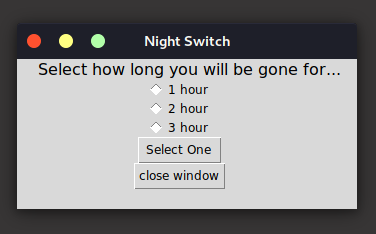

# NightSwitch
> Night Switch is a simple script used to shutdown your computer over a period of time.

## What's the purpose behind this script?

Okay say someone wants to listen to music and fall asleep, now you can leave your computer on all night and waste power or you can have it shutdown after a period of time.

Another reason can be having a large download and say you have to leave for school or work, and you want the computer to shutdown once the download is finished, this is what this script can do. Just specify the amount of time leave the terminal open and your SET!



## Requirements
Linux:

```
sudo apt-get install python3-tk
```

## Installation
Download the Repo
```
git clone https://github.com/RunaroundDK/NightSwitch
```

Change into the NightSwitch Directory
```
cd NightSwitch
```

Then Just run python3
```
python3 GUINightSwith.py
```

## Release History
* 0.0.1
    * Created the NightSwitch Original Code
* 0.1.0
    * Built the first GUI using python3-tk
* 0.1.1
    * Changed the time from mins to hours
    * Added a close button
